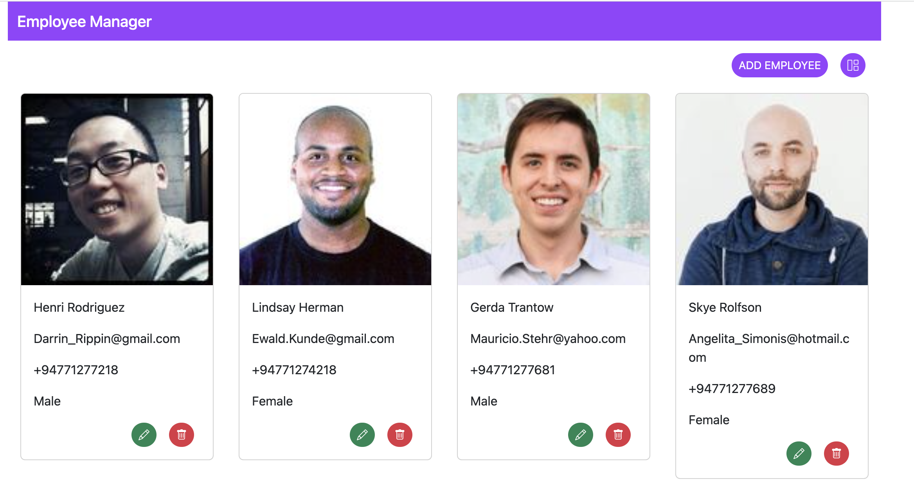
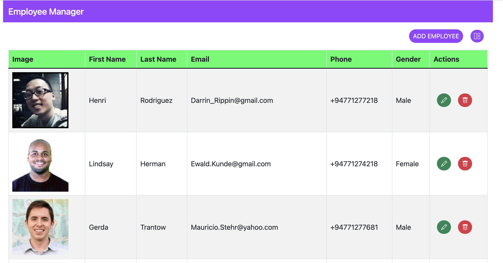
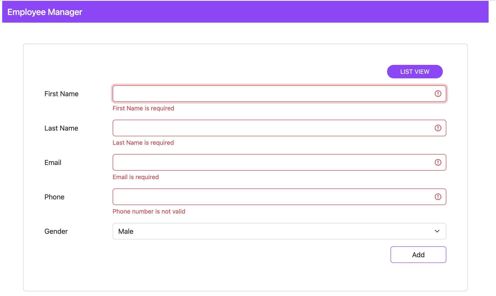
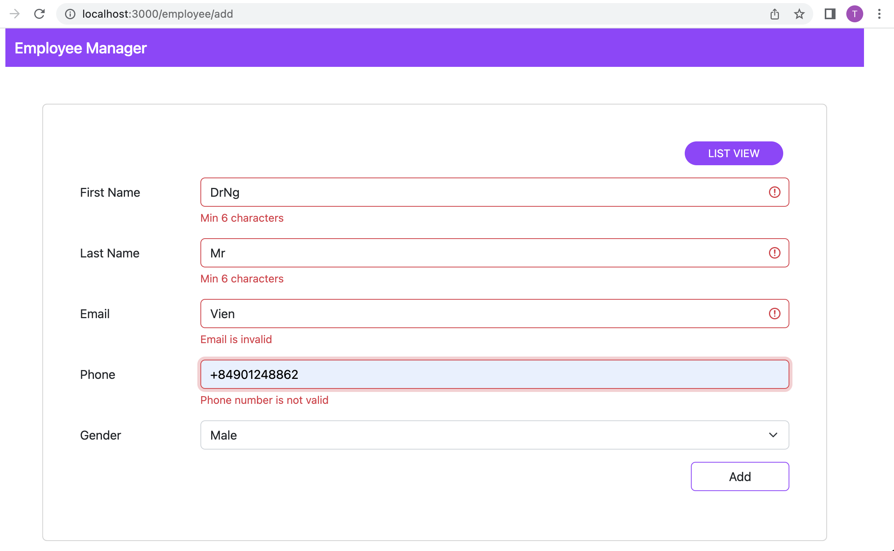

## Backend side
## Technical stack
1. NestJs framework
2. Typescript
3. MongoDB
4. Node 16
## Project structure
```
employee-management-api
----src
-------constants -> content all constant of applicatons
-------dtos -> data transfer object to connect controller to service
-------controllers -> To handle for all request from external
-------entities -> defined domaim
-------services -> handle for business user case
--------utils -> contain all of common function using in app by customize
```
## Databas design
```
{
    "firstName": "string",
    "lastName": "string",
    "email": "string",
    "phone": "string",
    "gender": "string"
}
```
### Code setup
```
import { Prop, Schema, SchemaFactory } from '@nestjs/mongoose'
import { Document } from 'mongoose'

export type EmployeeDocument = Employee & Document

@Schema()
export class Employee {
    @Prop()
    firstName: string
    @Prop()
    lastName: string
    @Prop()
    email: string
    @Prop()
    phone: string
    @Prop()
    gender: string // M: Male, F: Female
    @Prop()
    photo: string
}

export const EmployeeSchema = SchemaFactory.createForClass(Employee)
```

### Service implementation
implementing for use case which forcus on get all, get by id, create, update and delete an employee
```
import {Injectable} from "@nestjs/common";
import {InjectModel} from "@nestjs/mongoose";
import {Employee, EmployeeDocument} from "../entities/employee.entity";
import {Model} from "mongoose";
import {CreateEmployeeDto} from "../dtos/CreateEmployeeDto";

@Injectable()
export class EmployeeService {
    constructor(@InjectModel(Employee.name) private employeeModel: Model<EmployeeDocument>) {}

    async create(createEmployee: CreateEmployeeDto): Promise<Employee> {
        return this.employeeModel.create(createEmployee)
    }

    async update(id: string, updateEmployee: CreateEmployeeDto): Promise<any> {
        return this.employeeModel.updateOne({ _id: id }, updateEmployee)
    }

    async list(): Promise<Employee[]> {
        return this.employeeModel.find({})
    }

    async get(id: string): Promise<Employee> {
        return this.employeeModel.findById(id)
    }

    async delete(id: string): Promise<any> {
        return this.employeeModel.deleteOne({ _id: id })
    }

}
```
## API design
**BASE URI**: http://localhost:8080/api/v1
### API get list employees
#### **Request**
```
curl --location --request GET 'http://localhost:8080/api/v1/employees'
```
#### **Response**
```
[
    {
        "_id": "62f2767b04cc913e3729c5fc",
        "firstName": "Henri",
        "lastName": "Rodriguez",
        "email": "Darrin_Rippin@gmail.com",
        "phone": "+94771277218",
        "gender": "M",
        "id": "1",
        "photo": "https://randomuser.me/api/portraits/men/92.jpg"
    },
    {
        "_id": "62f2767b04cc913e3729c5fd",
        "firstName": "Lindsay",
        "lastName": "Herman",
        "email": "Ewald.Kunde@gmail.com",
        "phone": "+94771274218",
        "gender": "F",
        "id": "2",
        "photo": "https://randomuser.me/api/portraits/men/30.jpg"
    },
    {
        "_id": "62f2767b04cc913e3729c5fe",
        "firstName": "Gerda",
        "lastName": "Trantow",
        "email": "Mauricio.Stehr@yahoo.com",
        "phone": "+94771277681",
        "gender": "M",
        "id": "3",
        "photo": "https://randomuser.me/api/portraits/men/85.jpg"
    },
    {
        "_id": "62f2767b04cc913e3729c5ff",
        "firstName": "Skye",
        "lastName": "Rolfson",
        "email": "Angelita_Simonis@hotmail.com",
        "phone": "+94771277689",
        "gender": "F",
        "id": "4",
        "photo": "https://randomuser.me/api/portraits/men/75.jpg"
    },
    {
        "_id": "62f2767b04cc913e3729c600",
        "firstName": "Simeon",
        "lastName": "Russel",
        "email": "Fabiola_Heidenreich@yahoo.com",
        "phone": "+94771277682",
        "gender": "M",
        "id": "5",
        "photo": "https://randomuser.me/api/portraits/men/81.jpg"
    },
    {
        "_id": "62f2767b04cc913e3729c601",
        "firstName": "Kenyon",
        "lastName": "Fahey",
        "email": "Lia_Purdy@hotmail.com",
        "phone": "+94771277683",
        "gender": "F",
        "id": "6",
        "photo": "https://randomuser.me/api/portraits/men/31.jpg"
    },
    {
        "_id": "62f2767b04cc913e3729c602",
        "firstName": "Toni",
        "lastName": "Boyle",
        "email": "Vivien92@yahoo.com",
        "phone": "+94771277684",
        "gender": "M",
        "id": "7",
        "photo": "https://randomuser.me/api/portraits/men/88.jpg"
    },
    {
        "_id": "62f2767b04cc913e3729c603",
        "firstName": "Fredy",
        "lastName": "Fritsch",
        "email": "Christopher_Wisozk37@yahoo.com",
        "phone": "+94771277685",
        "gender": "M",
        "id": "8",
        "photo": "https://randomuser.me/api/portraits/men/61.jpg"
    },
    {
        "_id": "62f2767b04cc913e3729c604",
        "firstName": "Elvis",
        "lastName": "Konopelski",
        "email": "Mavis27@gmail.com",
        "phone": "+94771277686",
        "gender": "M",
        "id": "9",
        "photo": "https://randomuser.me/api/portraits/men/66.jpg"
    },
    {
        "_id": "62f2767b04cc913e3729c605",
        "firstName": "Lulu",
        "lastName": "Reinger",
        "email": "Melany_Rau70@gmail.com",
        "phone": "+94771277687",
        "gender": "F",
        "id": "10",
        "photo": "https://randomuser.me/api/portraits/men/32.jpg"
    },
    {
        "_id": "62f2767b04cc913e3729c606",
        "firstName": "Kelton",
        "lastName": "Rau",
        "email": "Patrick_Ratke@gmail.com",
        "phone": "+94771277688",
        "gender": "F",
        "id": "11",
        "photo": "https://randomuser.me/api/portraits/men/71.jpg"
    },
    {
        "_id": "62f2767b04cc913e3729c607",
        "firstName": "Adonis",
        "lastName": "Schuppe",
        "email": "Johann.Orn52@hotmail.com",
        "phone": "+94771277618",
        "gender": "M",
        "id": "12",
        "photo": "https://randomuser.me/api/portraits/men/36.jpg"
    }
]
```

### API get employee by id
#### **Request**
```
curl --location --request GET 'http://localhost:8080/api/v1/employees/:id'
```
#### **Response**
```
{
    "_id": "62f2767b04cc913e3729c5fc",
    "firstName": "Henri",
    "lastName": "Rodriguez",
    "email": "Darrin_Rippin@gmail.com",
    "phone": "+94771277218",
    "gender": "M",
    "id": "1",
    "photo": "https://randomuser.me/api/portraits/men/92.jpg"
}
```
### API create employee
#### **Request**
```
curl --location --request POST 'http://localhost:8080/api/v1/employees' \
--header 'Content-Type: application/json' \
--data-raw '{
    "firstName": "Henri",
    "lastName": "Rodriguez",
    "email": "Darrin_Rippin@gmail.com",
    "phone": "+94771277218",
    "gender": "M"
}'
```
#### **Response**
```
{
    "firstName": "Henri",
    "lastName": "Rodriguez",
    "email": "Darrin_Rippin@gmail.com",
    "phone": "+94771277218",
    "gender": "M",
    "_id": "62f286482eddf7862d0700e6"
}
```
### API update employee
#### **Request**
```
curl --location --request PUT 'http://localhost:8080/api/v1/employees/:id' \
--header 'Content-Type: application/json' \
--data-raw '{
    "firstName": "Henri",
    "lastName": "Rodriguez",
    "email": "Darrin_Rippin@gmail.com",
    "phone": "+94771277218",
    "gender": "F"
}'
```
#### **Response**
```
{
    "acknowledged": true,
    "modifiedCount": 1,
    "upsertedId": null,
    "upsertedCount": 0,
    "matchedCount": 1
}
```
### API delete employee
#### **Request**
```
curl --location --request DELETE 'http://localhost:8080/api/v1/employees/:id'
```
#### **Response**
```
{
    "acknowledged": true,
    "deletedCount": 1
}
```
## Frontend side
1. Typescript
2. Redux
3. Bootstrap

## Manual testing
### Backend validation
#### **Case 1**: First name is not alpha
##### **Request**
```
curl --location --request POST 'http://localhost:8080/api/v1/employees' \
--header 'Content-Type: application/json' \
--data-raw '{
    "firstName": "Henri",
    "lastName": "Rodriguez",
    "email": "Darrin_Rippin@gmail.com",
    "phone": "+94771277218",
    "gender": "F"
}'
```
##### **Responnse**
```
{
    "statusCode": 400,
    "message": [
        "firstName must contain only letters (a-zA-Z)"
    ],
    "error": "Bad Request"
}
```

#### **Case 2**: First name less than 6 characters
##### **Request**
```
curl --location --request POST 'http://localhost:8080/api/v1/employees' \
--header 'Content-Type: application/json' \
--data-raw '{
    "firstName": "Henri",
    "lastName": "Rodriguez",
    "email": "Darrin_Rippin@gmail.com",
    "phone": "+94771277218",
    "gender": "F"
}'
```
##### **Responnse**
```
{
    "statusCode": 400,
    "message": [
        "firstName must be longer than or equal to 6 characters"
    ],
    "error": "Bad Request"
}
```

#### **Case 3**: First name greater than 10 characters
##### **Request**
```
curl --location --request POST 'http://localhost:8080/api/v1/employees' \
--header 'Content-Type: application/json' \
--data-raw '{
    "firstName": "Henriaaaaaaaaaaaaaaaaa",
    "lastName": "Rodriguez",
    "email": "Darrin_Rippin@gmail.com",
    "phone": "+94771277218",
    "gender": "F"
}'
```
##### **Responnse**
```
{
    "statusCode": 400,
    "message": [
        "firstName must be shorter than or equal to 10 characters"
    ],
    "error": "Bad Request"
}
```

#### **Case 4**: Last name greater than 10 characters
##### **Request**
```
curl --location --request POST 'http://localhost:8080/api/v1/employees' \
--header 'Content-Type: application/json' \
--data-raw '{
    "firstName": "DrHenri",
    "lastName": "Rodriguezzz",
    "email": "Darrin_Rippin@gmail.com",
    "phone": "+94771277218",
    "gender": "F"
}'
```
##### **Responnse**
```
{
    "statusCode": 400,
    "message": [
        "lastName must be shorter than or equal to 10 characters"
    ],
    "error": "Bad Request"
}
```

#### **Case 5**: Last name less than 6 characters
##### **Request**
```
curl --location --request POST 'http://localhost:8080/api/v1/employees' \
--header 'Content-Type: application/json' \
--data-raw '{
    "firstName": "DrHenri",
    "lastName": "Rodri",
    "email": "Darrin_Rippin@gmail.com",
    "phone": "+94771277218",
    "gender": "F"
}'
```
##### **Responnse**
```
{
    "statusCode": 400,
    "message": [
        "lastName must be longer than or equal to 6 characters"
    ],
    "error": "Bad Request"
}
```

#### **Case 6**: Wrong email format
##### **Request**
```
curl --location --request POST 'http://localhost:8080/api/v1/employees' \
--header 'Content-Type: application/json' \
--data-raw '{
    "firstName": "DrHenri",
    "lastName": "Rodriguez",
    "email": "Darrin_Rippingmail.com",
    "phone": "+94771277218",
    "gender": "F"
}'
```
##### **Responnse**
```
{
    "statusCode": 400,
    "message": [
        "email must be an email"
    ],
    "error": "Bad Request"
}
```

#### **Case 7**: Wrong phone format
##### **Request**
```
curl --location --request POST 'http://localhost:8080/api/v1/employees' \
--header 'Content-Type: application/json' \
--data-raw '{
    "firstName": "DrHenri",
    "lastName": "Rodriguez",
    "email": "Darrin_Rippin@gmail.com",
    "phone": "94771277218",
    "gender": "F"
}'
```
##### **Responnse**
```
{
    "statusCode": 400,
    "message": [
        "phone must be a valid phone number"
    ],
    "error": "Bad Request"
}
```

#### **Case 8**: Wrong Gender
##### **Request**
```
curl --location --request POST 'http://localhost:8080/api/v1/employees' \
--header 'Content-Type: application/json' \
--data-raw '{
    "firstName": "DrHenri",
    "lastName": "Rodriguez",
    "email": "Darrin_Rippin@gmail.com",
    "phone": "+94771277218",
    "gender": "K"
}'
```
##### **Responnse**
```
{
    "statusCode": 400,
    "message": [
        "gender must be a valid enum value"
    ],
    "error": "Bad Request"
}
```

### Frontend validation
#### **Case 1** Grid view



#### **Case 2** list view


#### **Case 3** Required field


#### **Case 3** Required field


#### **Case 3** Required field


## How to run project
### STEP 1: clone source code
```
git clone git@github.com:congnguyenthanhdhbk/swivel-group.git
```
### STEP 2: Install and start backend
```
~ cd employee-managemet-api
~ npm install
~ npm run dev
**Notes**: Installed node 16 and npm 6
```
### STEP 3: Install and start fe
```
~ cd employee-managemet-ui
~ yarn install
~ yarn dev
- Open web brower and access to http://localhost:3001
**Notes**: Installed node 16 and npm 6
```
### STEP 4: Access to /scripts and run employee.json script in mongo tools to init data

# What's next
1. Deploy project on AWS or server suggestion to use docker or kubernetes
2. Support upload avatar in add form
3. Replaced unit test for manual test